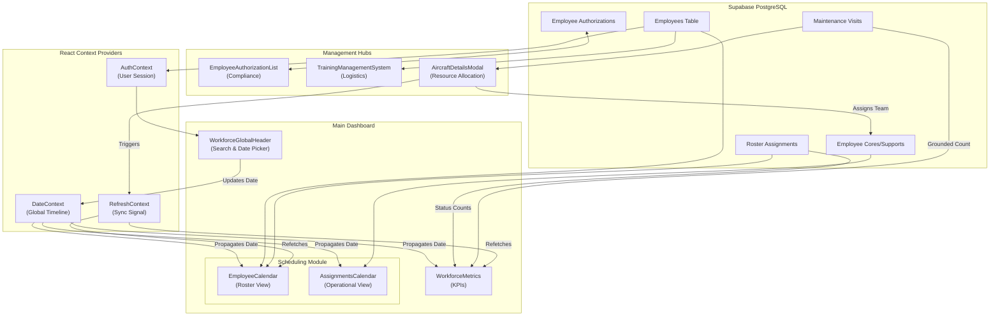

# Deep-Dive Project Understanding: Pie-MRO

## 1. System Philosophy
Pie-MRO is a specialized **Resource Planning & Compliance (RPC)** platform for the aviation industry. It doesn't just track time; it ensures that every person assigned to a task is **legally qualified** and **logistically available**.

---

## 2. Dynamic Scheduling Engine
The scheduling system (`EmployeeCalendar` and `AssignmentsCalendar`) is the most complex UI component in the app.

### 2.1. Grid Architecture
*   **Sticky Meta-Data:** Employee attributes (Job Title, Team, Check-in time) are sticky on the left to maintain context.
*   **Temporal Resolution:** Generates a dynamic 60-day scrolling window.
*   **Data Aggregation:** It merges `roster_assignments` (Availability) with `employee_supports` (Task Deployment).
*   **Intelligent Viewport:** `AssignmentsCalendar` performs a conditional display: it shows the **Aircraft Registration** instead of the status code (D/O/AL) if the employee is currently deployed to a maintenance line.

### 2.2. Multi-Dimensional Filtering
Every column in the calendar, including individual dates, has a dedicated `Popover` filter. Administrators can slice the workforce by Team, by specific License, or by who is "Off Duty" on a specific Tuesday.

---

## 3. Regulatory Compliance Layer
Managed via the **Certification Portal** (`EmployeeAuthorizationList`).

*   **Global Authority Matrix:** Tracks simultaneous approvals from **GCAA, EASA, FAA, ICAO, and UK CAA**. A single employee record manages distinct certificate numbers and remarks for each legal jurisdiction.
*   **Smart Query Parser:** The search bar supports advanced syntax like `employee=Ahmed, active=yes` to allow for rapid compliance auditing.
*   **Data Integrity:** Inline CRUD operations use relational lookups to ensure authorizations are tied to verified Aircraft Models and Engine Types.

---

## 4. Smart Training Management (TMS)
The `TrainingManagementSystem` acts as an automated workforce developer.

*   **Priority Algorithm:** Calculates an "Urgency Score" for training based on:
    *   Days until license expiry.
    *   Performance ratings.
    *   Aircraft maintenance demand.
*   **Substitution Logic:** When a "Swap" is needed, the system calculates a **Top 5 Qualified Candidates** list by cross-referencing session prerequisites with the global employee license matrix.
*   **Analytics:** Built-in tracking for center utilization, completion rates, and instructor performance.

---

## 5. Module Hub & Navigation Logic
The `ManagementShortcuts.tsx` component serves as the application's **Functional Gateway**.

### 5.1. Modal-First Strategy
Instead of traditional page-routing, Pie-MRO uses a **High-Density Modal Pattern** for management tasks. 
*   **Context Retention:** Modules like the *Certification Portal* and *TMS* open in a full-screen `Dialog` (`95vw` width). 
*   **Benefits:** This allows users to perform complex administrative CRUD operations (like updating a license) without losing their temporal position or scroll state on the main scheduling calendars.

### 5.2. Component Hot-Swapping
The hub uses a state-driven approach to inject components into the master modal:
*   `activeShortcut.id === "certification-portal"` -> Injects `EmployeeAuthorizationList`.
*   `activeShortcut.id === "training-management"` -> Injects `TrainingManagementSystem`.
*   *Planned Modules:* Placeholder logic exists for *Leave Management*, *Employee management*, and *Weekly Offs*.

---

## 7. Application Data Flow

The following diagram illustrates how data propagates from the Supabase backend through the application's context providers and into the key UI modules.

### Flow Description:
1.  **Initialization:** `AuthContext` authenticates the user. `DateContext` initializes to "Today".
2.  **Global Synchronization:** When a user changes the date in `WorkforceGlobalHeader`:
    *   `DateContext` updates.
    *   `WorkforceMetrics` immediately queries `roster_assignments` for that specific day.
    *   `EmployeeCalendar` and `AssignmentsCalendar` shift their 60-day window.
3.  **Operational Write:**
    *   User opens `AircraftDetailsModal` -> Assigns a team -> Writes to `employee_cores`.
    *   The modal calls `triggerRefresh()`.
    *   `RefreshContext` broadcasts a signal.
    *   `WorkforceMetrics` re-runs its query, instantly updating the "Available Employees" count.